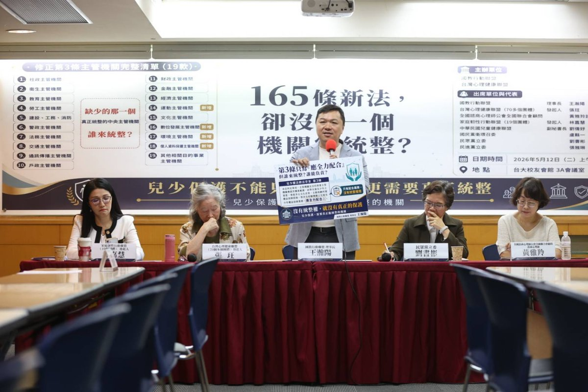

國教行動聯盟
 |
 政策知識庫
 |
 兒少權益
 
 

 
 

 
 
 

# 兒童家庭部組織法該怎麼寫?16 條草案與雙條同修法律承諾解析

 
 
 2026 年 5 月 12 日
 [國教行動聯盟](https://naer-tw.github.io/policy/#organization) × 台灣心理健康聯盟 × 家庭韌性行動聯盟
 審稿:王瀚陽 理事長
 分類:兒少權益
 

 
 
 

## 30 秒掌握重點

 

 - **16 條 5 章草案:**包含法定勸告權、兒少代表至少 1/3 強制條款、預算特別會計、獨立監督。

 - **修正第 2 條與第 3 條雙條同修是承諾載體:**§2 寫身份升格、§3 寫權限增訂,業務法可以要求行政院限期提組織法草案。

 - **三軌並進:**升格 × 預算追蹤(對標日本特別會計)× 獨立監督(對標挪威 Barneombudet),缺一不可。

 

 

 
 
 

 **兒童家庭部組織法草案應寫入「法定勸告權」、「兒少代表 1/3 強制參與」、「預算特別會計」與「獨立監督」四大核心。**
 借兒少權法修正第 2 條與第 3 條「雙條同修」(§2 身份升格 + §3 權限增訂)作為法律承諾載體,要求行政院於修法施行後一定期限內提出組織法草案[[1]](#source-1)。設計核心對標日本こども家庭庁(2023)、挪威Barneombudet(1981)、與聯合國兒童權利委員會 General Comment No. 2(獨立人權機構)及 No. 19(兒少預算)[[7]](#source-7)。
 

 

 
 

## 兒童家庭部要負責哪些業務?

 

 國教行動聯盟版「兒童家庭部組織法草案」共 5 章 16 條[[10]](#source-10),規範事項涵蓋設置、職權、組織、人事與預算。本部負責業務,以「兒少權法修正第 2 條(中央主管機關)與第 3 條(19 款目的事業主管機關)之兒少政策統籌」為核心:
 

 
 
 

### 兒少福利與保護

 

兒少保護案件、收出養、安置照顧、脆弱家庭整合服務、居家托育人員管理(吸納原衛福部社家署、保護服務司業務)。

 
 
 

### 兒少心理健康與發展

 

兒少自殺防治、心理疾病早期識別、學校心理健康、童年逆境經驗(ACEs)介入(吸納原衛福部心理健康司部分業務)。

 
 
 

### 兒少數位安全與媒體

 

數位性別暴力防制、平台年齡管控、預先安全設計、數位影像專章執法(對標 EU AI Act 兒少條款)。

 
 
 

### 家庭支持與韌性

 

家庭資源中心、單親/多元家庭支持、特殊兒少家庭照顧者支持、跨部會社區資源整合。

 
 
 

### 兒少代表參與

 

兒童權益促進委員會兒少代表至少 1/3 強制條款、各級政府兒少諮詢機制、CRC 第 12 條表意權之具體實踐。

 
 
 

### 跨部會兒少政策統籌

 

對教育、警政、司法、勞動、數位、文化、原民等 11+ 二級部會之兒少業務,擁有法定勸告權、資料調取權、政策追蹤權。

 
 

 
 

## 怎麼確保「跨部會勸告權」的法律授權?

 

 這是組織法草案最關鍵的條款。國教盟版草案第 5 條(職權)明訂:
 

 
 

#### 草案第 5 條(職權)摘錄

 

「兒童家庭部對其他部會之兒少業務,得提出勸告,被勸告之機關應於 30 日內具體回應。本部對被勸告機關之回應內容,得提報行政院院會討論。」

 
 

 此條款設計直接對標日本こども家庭庁設置法第 4 條規定的「勧告権」[[2]](#source-2)。沒有此條款,即使升至二級部,亦無法解決「19 款主管機關分散」的結構性問題。
 

 | 勸告權設計 | 日本こども家庭庁(2023) | 台灣兒童家庭部(本草案) |
| --- | --- | --- |
| 法律授權 | 設置法第 4 條 | 組織法第 5 條 |
| 被勸告機關回應期限 | 具體回應(無明定期限) | 明定 30 日 |
| 提報內閣/院會機制 | 內閣特命大臣 | 提報行政院會 |

 
 

## 兒少預算追蹤怎麼做?(對標日本特別會計)

 

 升格不是萬靈丹。本倡議主張「升格 + 預算追蹤 + 獨立監督」三軌並進。預算追蹤的設計分兩階段:
 

 

### 第一階段(2026-2028):預算分類與揭露

 

 要求各部會於年度預算書中,明確標示「兒少相關預算」分類碼,並由兒童家庭部彙整年度兒少預算總覽,提送立法院與監察院。此階段不涉及預算結構大改,只要求「揭露透明」。
 

 

### 第二階段(2028-2030):特別會計

 

 研議設立「兒少預算特別會計」,對標日本 2024 年 4 月新設立之「子ども・子育て支援特別會計」[[3]](#source-3)。日本特別會計年規模約 3 兆日圓,將原散落於各省廳之兒少預算統一管理,並可跨年度滾動運用。
 

 

### 對標 CRC General Comment No. 19(兒少預算)

 

 聯合國兒童權利委員會 2016 年發布 General Comment No. 19,要求締約國應「明確標示、追蹤、報告」兒少相關預算[[7]](#source-7)。台灣雖非聯合國成員,但 2014 年已通過《兒童權利公約施行法》內國法化 CRC,理應落實 GC 19 之預算透明要求。
 

 
 

## 獨立兒少權利監督怎麼設計?

 

 組織法之外,本倡議第三項訴求是建立獨立兒少權利監督機制。設計核心對標兩個國際範本:
 

 

### 範本一:挪威 Barneombudet 模式

 

 挪威 1981 年通過《兒童監察使法》設立全球首位兒童監察使(Barneombudet)[[4]](#source-4):
 

 

 - 由國王任命、6 年任期、獨立於行政機關

 - 具有對所有政府機關之調查與建議權

 - 每年向國會提出兒少權利現況報告

 - 可代表個別兒少發聲,對重大兒少議題提出公開意見

 

 

### 範本二:CRC General Comment No. 2(獨立人權機構)

 

 CRC 2002 年發布 General Comment No. 2,要求締約國應設立獨立國家人權機構負責監督兒童權利[[6]](#source-6)。該機構應符合「巴黎原則」(Paris Principles),具備獨立性、廣泛權限、適足資源。
 

 

### 台灣現況與設計建議

 

 台灣 2020 年於監察院設立國家人權委員會,並於 2024 年公布兒童權利監測指標[[5]](#source-5)。本倡議建議:
 

 
 
 

### 強化既有機制

 

檢討《兒童權利公約施行法》第 6 條「行政院兒童及少年福利與權益推動小組」定位,避免行政機關球員兼裁判。

 
 
 

### 結合 NHRC 監測

 

立法明定兒童家庭部年度報告應接受國家人權委員會兒童權利監測指標審查,並由委員會獨立提出評估報告。

 
 
 

### 兒少代表參與

 

監督機制應包含兒少代表參與,呼應 CRC 第 12 條表意權,並對標挪威 Barneombudet 之兒少諮詢制度。

 
 

 
 

## 為什麼一定要在修正第 2 條與第 3 條「雙條同修」?

 

 這是本倡議最常被質疑的問題:「兒少權法是業務法,可以寫組織升格嗎?」答案是:**修正第 2 條本身就是規定中央主管機關身份的條文、修正第 3 條本身就是規定 19 款目的事業主管機關權責的條文,於 §2 明定身份升格、於 §3 增訂跨部會統整權限,即「雙條同修」,完全合法、合理**。
 

 

### 類似立法先例

 | 法律 | 條文 | 內容 |
| --- | --- | --- |
| 精神衛生法 | 第 2 條 | 明定中央主管機關為衛生福利部,並列舉中央與地方權責[8] |
| 家庭教育法 | 第 2 條 | 明定中央主管機關為教育部,並設家庭教育中心[9] |
| 兒少權法(現行) | 修正第 2 條與第 3 條 | §2 規定中央主管機關、§3 列舉 19 款目的事業主管機關,但僅以「應全力配合」作為跨部會基礎(本次需「雙條同修」補強) |

 

### 本倡議建議修正第 2 條與第 3 條「雙條同修」補強條款

 
 

#### 修正第 2 條(身份升格)

 

「本法所稱主管機關,在中央為**兒童家庭部**;在地方為直轄市、縣(市)政府(以下簡稱地方主管機關)。」

 

#### 修正第 3 條(權限增訂)

 

「中央主管機關得就第一項各款業務,要求各目的事業主管機關提出資料、說明及必要協力;並得就跨部會兒少政策事項,進行政策企劃、立案與綜合調整。中央主管機關應於本法修正施行後 3 年內,由行政院提出『兒童家庭部組織法』草案送立法院審議。」

 
 

 此設計讓兒少權法成為升格的「法律承諾載體」,既不取代未來組織法,也確保升格不會在政黨輪替中被輕易擱置。
 

 
 
 
_
 國教行動聯盟理事長 **王瀚陽**(中)持「修正第 3 條」訴求牌發言。背景為「修正第 3 條主管機關完整清單(19 款)」。
 攝於 2026.05.12 兩會聯合記者會 · 台大校友會館 3A 會議室
 _

 

 
 

「兒少權法修到 165 條,不能只問多了哪些責任,更要問誰有權限整合。孩子不能再被卡在 19 款主管機關之間——這次修法真正要補的,是能在行政院層級為孩子負責的兒童家庭部。」

 —— 王瀚陽,國教行動聯盟理事長(2026.05.12 兩會聯合記者會)
 

 
 
 

## 立法 Q&A:常見質疑與回應

 
 

### Q1:兒少權法是業務法,可以寫組織升格嗎?

 

可以。兒少權法修正第 2 條規定中央主管機關「身份」(衛福部 → 兒童家庭部),修正第 3 條規定 19 款目的事業主管機關之「權責劃分」。兩會主張§2 與 §3「雙條同修」:於修正第 2 條明定中央主管機關為兒童家庭部、於修正第 3 條同步增訂跨部會統整權限(資料提出要求、說明要求、必要協力請求權、政策企劃與綜合調整),並要求行政院於修法施行後一定期限內提出組織法草案,完全是業務法可以做的事。實際上《精神衛生法》第 2 條、《家庭教育法》第 2 條等都有類似條款。

 
 
 

### Q2:兒家署 2026 年要掛牌,升格倡議要把案子撤回嗎?

 

不需要。本倡議是「不是反兒家署,而是反以三級署為終點」。兒家署可以是短期過渡的整合起點,但本次修正第 2 條與第 3 條應「雙條同修」(§2 身份升格 + §3 權限增訂),同步明定升格方向。倡議建議:兒家署於成立後 3 年內,行政院應提出兒童家庭部組織法草案。

 
 
 

### Q3:升格會增加多少預算與人力?

 

對標日本こども家庭庁初始編制約 430 人、年預算約 5 兆日圓(含原各省廳兒少業務移撥),台灣兒童家庭部初步估計編制 300-400 人、年預算約 1,500-2,000 億新台幣(含原衛福部、教育部、勞動部部分業務移撥)。重點是整合既有預算,而非新增。

 
 
 

### Q4:英國 DCSF 只存在 3 年就被裁撤,升格不是萬靈丹?

 

正確。英國 DCSF(2007–2010)因政黨輪替被裁撤,凸顯了「沒有跨黨派共識」與「沒有獨立監督機制」的脆弱。這正是本倡議「升格 + 預算追蹤 + 獨立監督」三軌並進的原因——獨立監督機制可避免政黨輪替時的政策大幅倒退。

 
 
 

### Q5:中央行政機關組織基準法對「部」的總數有上限,真的還有空間設兒童家庭部嗎?

 

依《中央行政機關組織基準法》第 29 條規定,行政院「部」的總數以 15 個為限。2024 年底配合運動部成立,將上限由 14 個調整為 15 個;運動部已於 2025 年正式成立,目前 15 個部名額已滿。若要再設「兒童家庭部」,須再修法提高基準法上限,或透過整併現有部會、改設委員會或署局等方式處理。國教行動聯盟主張採前者(提高基準法上限),韓國 2025 年成立性平等家族部即為立法擴權之國際先例。

 
 
 

### Q6:過渡期設多久比較合理?

 

本倡議建議分兩階段:第一階段(2026-2028)兒少及家庭支持署成立並運作;第二階段(2028-2030)行政院依本次修正第 2 條與第 3 條「雙條同修」之法律承諾,提出兒童家庭部組織法草案,完成升格。3-4 年的過渡期,讓兒家署的整合經驗能轉化為兒童家庭部的組織基礎。

 
 
 

### Q7:組織法為什麼要強制兒少代表參與?

 

呼應 CRC 第 12 條表意權與 General Comment No. 12 對兒少參與的具體要求。本倡議建議組織法明定:兒童權益促進委員會委員應有未滿 18 歲兒少代表至少三分之一,並由兒少自治團體推派,避免成人代理。

 
 
 

### Q8:特別會計與一般預算的差別是什麼?

 

一般預算由各部會分別編列、年度結束即清算;特別會計可跨年度滾動運用、財源獨立、便於追蹤。日本子ども・子育て支援特別會計年規模約 3 兆日圓,將原散落於各省廳之兒少預算統一管理,顯著提升透明度與政策連續性。

 
 
 

### Q9:兒童家庭部與兒少及家庭支持署的差異一句話?

 

「兒家署是把分散在衛福部內的兒少業務整合起來,但仍是衛福部下的三級機關;兒童家庭部是把分散在 11+ 部會的兒少業務統籌起來,直接列席行政院會、有法定勸告權,是內閣層級的二級部會。」

 
 

 
 
 

### 相關議題

 

 - [為什麼台灣需要把兒少主管機關升格為「兒童家庭部」?(WHY 篇)](https://naer-tw.github.io/policy/child-rights/20260512-children-families-ministry-why.html)

 - **[🌐 國教盟兒少權法修法知識庫(完整論述、6 大缺口立法草案、21 國國際對標、27 篇政策論述)](https://naer-tw.github.io/policy/cwa-reform/)**

 - [6 大缺口完整立法草案(RP-G01~G06,可作為立委版獨立提案文字基礎)](https://naer-tw.github.io/policy/cwa-reform/reform-proposals/)

 - [21 國國際對標卡(strength / weakness / applicability 三欄齊全)](https://naer-tw.github.io/policy/cwa-reform/intl-benchmarks/)

 - [全國法規資料庫——兒童及少年福利與權益保障法](https://law.moj.gov.tw/LawClass/LawAll.aspx?pcode=D0050001)

 - [全國法規資料庫——中央行政機關組織基準法](https://law.moj.gov.tw/LawClass/LawAll.aspx?pcode=A0010036)

 - [日本こども家庭庁官網](https://www.cfa.go.jp/)

 - [監察院國家人權委員會——兒童權利監測指標](https://nhrc.cy.gov.tw/)

 - [國教行動聯盟臉書](https://www.facebook.com/twedumove/)

 

 

 
 
 

### 參考文獻

 

 - 立法院(無日期)。兒童及少年福利與權益保障法修正第 3 條。全國法規資料庫。[https://law.moj.gov.tw/LawClass/LawAll.aspx?pcode=D0050001](https://law.moj.gov.tw/LawClass/LawAll.aspx?pcode=D0050001)

 - こども家庭庁 (2023). こども家庭庁設置法. 日本內閣府. [https://www.cfa.go.jp/about/](https://www.cfa.go.jp/about/)

 - 財務省 (2024). 子ども・子育て支援特別会計. 日本財務省. [https://www.mof.go.jp/](https://www.mof.go.jp/)

 - Barneombudet. (n.d.). About the Norwegian Ombudsman for Children. Norwegian Ombudsman for Children. [https://www.barneombudet.no/english](https://www.barneombudet.no/english)

 - 監察院國家人權委員會(2024)。兒童權利公約獨立評估意見書(兒童權利監測指標)。監察院。[https://nhrc.cy.gov.tw/](https://nhrc.cy.gov.tw/)

 - UN Committee on the Rights of the Child. (2002). General Comment No. 2: The role of independent national human rights institutions in the promotion and protection of the rights of the child (CRC/GC/2002/2). United Nations. [https://www.ohchr.org/en/treaty-bodies/crc/general-comments](https://www.ohchr.org/en/treaty-bodies/crc/general-comments)

 - UN Committee on the Rights of the Child. (2016). General Comment No. 19 on public budgeting for the realization of children's rights (art. 4) (CRC/C/GC/19). United Nations. [https://www.ohchr.org/en/documents/general-comments-and-recommendations/general-comment-no-19-2016-public-budgeting](https://www.ohchr.org/en/documents/general-comments-and-recommendations/general-comment-no-19-2016-public-budgeting)

 - 立法院(無日期)。精神衛生法第 2 條。全國法規資料庫。[https://law.moj.gov.tw/LawClass/LawAll.aspx?pcode=L0020030](https://law.moj.gov.tw/LawClass/LawAll.aspx?pcode=L0020030)

 - 立法院(無日期)。家庭教育法第 2 條。全國法規資料庫。[https://law.moj.gov.tw/LawClass/LawAll.aspx?pcode=H0080050](https://law.moj.gov.tw/LawClass/LawAll.aspx?pcode=H0080050)

 - 國教行動聯盟(2026年5月10日)。兒童家庭部組織法草案(國教盟版)。國教行動聯盟政策資料庫。[https://www.facebook.com/twedumove/](https://www.facebook.com/twedumove/)

 

 

 
 
 

此頁面最後更新於 2026 年 5 月 12 日 | 國教行動聯盟政策知識庫

 

新聞聯絡:國教行動聯盟 王瀚陽 理事長 0983-097165