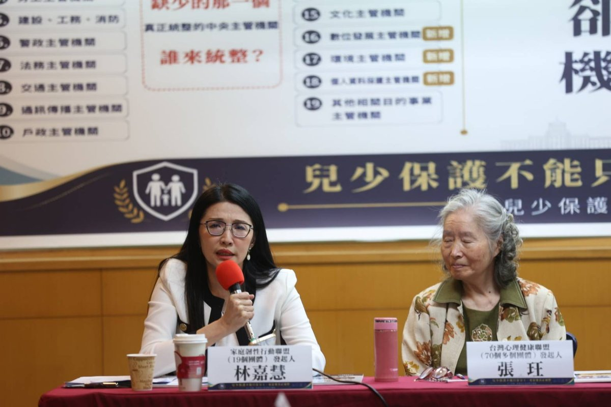

國教行動聯盟
 |
 政策知識庫
 |
 兒少權益
 
 

 
 

 
 
 

# 為什麼台灣需要把兒少主管機關升格為「兒童家庭部」?

 
 
 2026 年 5 月 12 日
 [國教行動聯盟](https://naer-tw.github.io/policy/#organization) × 台灣心理健康聯盟
 審稿:王瀚陽 理事長
 分類:兒少權益
 

 
 
 

## 30 秒掌握重點

 

 - **歷史窗口:**兒少權法施行 15 年來最大幅度的全文修正,2026 大修是把「兒童家庭部」寫進法律的唯一機會。

 - **結構失靈:**修正第 3 條列 19 款主管機關、涉 14 個以上二級部會與獨立機關,三級署長進不了行政院會、無法定勸告權。

 - **數據急迫:**通報 5 年增 65%、2024 致死 8 年新高、處置率僅 7%。

 

 

 
 
 

 **因為兒少權法 165 條再多,沒有一個夠層級的中央主管機關能統整。**
 台灣兒少議題橫跨衛福、教育、警政、司法、勞動、數位、文化等 14 個以上二級部會與獨立機關[[1]](#source-1),但目前規劃中的「兒少及家庭支持署」僅為三級機關。兩會於 2026 年 5 月 12 日聯合呼籲:應於兒少權法修正第 2 條與第 3 條「雙條同修」——§2 明定中央主管機關為「兒童家庭部」(身份升格)、§3 增訂跨部會統整權限——升格為部會層級的「兒童家庭部」(行政院所屬二級機關),對標日本 2023 年成立的こども家庭庁(直屬首相、設特命大臣、有法定勸告權)[[9]](#source-9)。
 

 

 
 

## 為什麼借兒少權法修正第 2 條與第 3 條「雙條同修」來推動升格?

 

 台灣的兒少主管機關歷史,是一段「設置 → 縮編 → 再設置」的反覆過程。2013 年衛福部成立時,內政部兒童局熄燈、業務縮編為「保護服務司」,兒少議題從此失去部級主管機關發聲[[2]](#source-2)。13 年後的今天,衛福部規劃成立「兒少及家庭支持署」(三級署),但若不在修正第 2 條與第 3 條「雙條同修」(身份升格+權限增訂)同步明定升格方向,沒有人能保證 13 年後不會重演熄燈悲劇。
 

 

 2024 年 3 月揭露的剴剴案,凸顯了現行制度「中央、地方、委外機構與第一線缺乏跨系統協調」的結構性缺口。2025 年 5 月 29 日監察院糾正衛福部、新北市政府與臺北市政府時,即指出相關機關分別負有收出養媒合、脆弱家庭整合服務、居家托育人員管理等責任,卻缺乏橫向聯繫及資訊流通[[3]](#source-3)。
 

 
 
 1973
 公布《兒童福利法》,兒少議題首次進入國家立法。
 
 
 1999
 內政部「兒童局」設立,二級署層級。
 
 
 2011
 《兒童及少年福利與權益保障法》通過,擴充至 118 條。
 
 
 2013
 衛福部成立、兒童局熄燈、降為三級保護服務司。
 
 
 2024.03
 剴剴案揭露,跨系統協調失靈成為全民議題。
 
 
 2026.04.21
 衛福部公告兒少權法全文修正草案(118→165 條),預計成立三級「兒少及家庭支持署」[[8]](#source-8)。
 
 
 2026.05.12
 兩會聯合呼籲:於修正第 2 條與第 3 條「雙條同修」、升格為部會層級的「兒童家庭部」(行政院所屬二級機關)。
 
 

 
 

## 三級「兒少及家庭支持署」有什麼結構性問題?

 

 兒少權法修正第 3 條(對應現行第 7 條)列舉 19 款目的事業主管機關,涉及衛福、教育、警政、司法、勞動、數位、文化、原民、地方政府等 14 個以上二級部會與獨立機關,卻僅以「應全力配合」作為跨部會整合基礎[[1]](#source-1)。三級署長依《中央行政機關組織基準法》規定,既無法列席行政院會,也沒有對其他二級部會的法定勸告權[[4]](#source-4)。
 

 

 國教行動聯盟理事長王瀚陽指出:「即使成立兒少及家庭支持署,也只是『有責任、無權限』的三級機關。本盟已備有完整『兒童家庭部組織法草案』16 條 5 章,可立即進入立法討論。」
 

 | 制度面向 | 三級「兒家署」(現行規劃) | 部會層級「兒童家庭部」(行政院所屬二級機關,本倡議) |
| --- | --- | --- |
| 列席行政院會 | 不列席 | 列席(部長級) |
| 跨部會勸告權 | 無法律授權 | 法律授權(對標日本こども家庭庁) |
| 編制人力 | ~200 人(三級規模) | ~300 人(對標日本初始編制) |
| 專任部長/特命大臣 | 無 | 有 |
| 對 11+ 二級部會之兒少業務統籌 | 平行機關,無權整合 | 統籌規劃、追蹤管考 |

 
 

## 國際上其他國家怎麼做兒少政策升格?

 

 跨越 95 年的國際經驗清楚顯示,兒少政策必須進入更高層級治理。兩會整理出三種國際典範與 6 個重大兒虐案的法律回應對照:
 

 

### 典範一:獨立監察使模式(挪威 1981)

 

 挪威 1981 年通過《兒童監察使法》(Lov om Barneombud),設立全球首位兒童監察使(Barneombudet),由國王任命、6 年任期、獨立於行政機關之外,具有對所有政府機關的調查與建議權[[10]](#source-10)。
 

 

### 典範二:獨立法定機構模式(愛爾蘭 2014)

 

 愛爾蘭 2014 年通過《Child and Family Agency Act》,從衛福部 HSE 獨立成Tusla 兒少法定機構,涵蓋約 4,000 人,專責兒少保護、家庭支持與寄養照顧[[11]](#source-11)。
 

 

### 典範三:行政院層級部會模式(日本 2023)

 

 日本 2023 年 4 月設立內閣府外局「こども家庭庁」,直屬首相、設專任「特命大臣」、編制約 430 人、配套「子ども・子育て支援特別會計」,並對其他省廳擁有法定勸告權[[9]](#source-9)。
 

 

### 6 國重大兒虐案立法對照

 | 國家/年份 | 事件 | 法律位階回應 |
| --- | --- | --- |
| 英國 英國 2000 | Victoria Climbié 案 | 2003 Every Child Matters → 2007 DCSF[12] |
| 愛爾蘭 愛爾蘭 2010 | Roscommon House of Horrors | 2014 Tusla 兒少獨立機構[11] |
| 日本 日本 2018 | 結愛(目黒区5歲女童)案 | 2023 こども家庭庁設置[9] |
| 韓國 韓國 2020 | 正仁(チョンイン)案 | 2025 強化 성평등가족부[13] |
| 挪威 挪威 1981(預防) | 主動立法 | 1981 Barneombudet 設立[10] |
| 台灣 台灣 2024 | 剴剴案 | 165 條中六大缺口仍是零條款 |

 

 **關鍵發現:6 個其他國家的重大兒虐案,全部升至法律位階回應;台灣剴剴案 2 年後,165 條中六大結構缺口仍是零條款。**
 

 
 

## 升格的數據急迫性是什麼?

 

 台灣兒少危機的具體規模,可以從衛福部 2025 年公開統計看出三條警訊:
 

 

### 警訊一:兒少保護通報量 5 年增 65%

 

 依衛福部統計,兒少保護通報量從 2020 年的 71,549 件,5 年內增至 2024 年的 118,497 件,增幅達 65%[[5]](#source-5)。2025 年再升至 136,592 件。
 

 

### 警訊二:2024 年家內施虐致死創 8 年新高

 

 2024 年家內施虐致死 30 件,創 8 年新高[[5]](#source-5)。剴剴案於 2024 年 3 月揭露,同年的全年致死數,反而是過去 8 年的最高峰——這顯示「事件揭露」並未促成系統性改善。
 

 

### 警訊三:通報量增加,但確認比例僅 7.2%

 

 2025 年通報量 136,592 件,實際確認受虐 9,898 件,確認比例僅 7.2%[[5]](#source-5)。通報量快速增加,但經確認的受虐人數未同步增加——這不是單一機關能處理的行政問題,而是跨衛福、教育、警政、司法與地方政府的治理壓力。
 

 

### 警訊四:兒少自殺率 10 年增 9 倍

 

 14 歲以下每 10 萬人口自殺死亡率由 2014 年的 0.1 人,攀升至 2023 年的 0.9 人(10 年增 9 倍);15 至 24 歲自殺死亡率從 5.1 人升至 10.9 人(翻倍)[[6]](#source-6)。兒少心理健康危機已涉及醫療、教育、社政、家庭支持與數位風險 5 個面向,但目前的「心理健康司」與規劃中的「兒家署」均無能力統籌跨部會資源。
 

 
 

「兒少心理健康若沒有跨部會統整機制,再多預算都會被切割。最根本的,是把主管機關升格為兒童家庭部,才有可能跨部會整合。兒少權法應認真思考設立『兒少數位影像與數位傷害』專章。」

 —— 黃雅羚 諮商心理師,台灣心理健康聯盟代表 / 全國諮商心理師公會全國聯合會顧問(2026.05.12 兩會聯合記者會)[[15]](#source-15)
 
 

### 警訊五:六分之五的精神疾病學童未獲醫療照護

 

 家庭韌性行動聯盟發起人林嘉慧引用實證:「台灣有精神疾病診斷的學童,只有 六分之一獲得醫療照護[[7]](#source-7)。其他六分之五的孩子去哪了?他們回家了——不是因為他們好了,而是因為制度沒有接住他們。」

 

 
 
 
_
 家庭韌性行動聯盟發起人**林嘉慧**(左)發言,右側為台灣心理健康聯盟發起人**張珏**。背景為記者會主視覺「19 款主管機關,誰來統整?」
 攝於 2026.05.12 兩會聯合記者會 · 台大校友會館 3A 會議室
 _

 
 
 

「當制度反覆把孩子退回家庭,卻不給家庭支持時,我們不是在依靠家庭的韌性,我們是在消耗它。家庭韌性不是天生的,不是咬牙就能撐出來的——它需要制度的接住,才能生長。」

 —— 林嘉慧,家庭韌性行動聯盟發起人(2026.05.12 兩會聯合記者會)[[14]](#source-14)
 

 
 

## 為什麼這不是反兒少及家庭支持署?

 

 兩會的立場很清楚:**不是反兒家署,而是反「以三級署為終點」**。兒家署可以是短期過渡的整合起點,但兒少議題的重要性已超過三級署所能承擔的層級。台灣 兒少權法施行 15 年來最大幅度的全文修正,不能只增條文卻不升組織。
 

 

 國教盟強調:「兒少議題是『無藍綠空間』的最大政策議題——孩子的處境不分顏色、不分黨派,所有政黨都應該共同為這一代與下一代孩子的制度基礎負責。」
 

 
 
 

## 兩會聯合三項訴求

 
 
 

### 1. 升格

 

於兒少權法修正第 2 條與第 3 條「雙條同修」:§2 明定中央主管機關為「兒童家庭部」(身份升格)、§3 增訂跨部會統整權限(資料提出要求、說明要求、必要協力請求權、政策企劃與綜合調整),升格為部會層級的「兒童家庭部」(行政院所屬二級機關),並要求行政院於修法施行後限期提出組織法草案。

 
 
 

### 2. 預算追蹤

 

建立各部會兒少預算分類、揭露與年度追蹤制度;第二階段研議設立兒少預算專款或特別會計,對標日本「子ども・子育て支援特別會計」。

 
 
 

### 3. 獨立監督

 

結合監察院國家人權委員會兒童權利監測指標,建立能持續追蹤、評估、公開報告的獨立監督制度,避免行政機關球員兼裁判。

 
 
 

 
 
 

## 常見問題

 
 

### Q1:什麼是兒童家庭部?

 

兒童家庭部是國教行動聯盟、台灣心理健康聯盟與家庭韌性行動聯盟共同倡議成立的二級中央部會,專責兒少福利、保護、心理健康、家庭支持與跨部會兒少政策統籌,對標日本 2023 年成立的「こども家庭庁」(直屬首相、設特命大臣、有法定勸告權)。

 
 
 

### Q2:為什麼三級的「兒少及家庭支持署」不夠?

 

三級署長無法列席行政院會,也沒有對其他二級部會的法定勸告權。當兒少議題橫跨衛福、教育、警政、司法、勞動、數位、文化等 14 個以上二級部會與獨立機關時,三級署長無法協調二級部的部長,只會成為「有責任、無權限」的責任中心。

 
 
 

### Q3:兒少權法修正第 2 條與第 3 條為什麼是雙條同修的關鍵?

 

修正第 2 條規定中央主管機關「身份」(衛福部 → 兒童家庭部),修正第 3 條規定中央兒少主管機關與 19 款目的事業主管機關的「權責劃分」。兒少權法施行 15 年來最大幅度的全文修正,兩會主張雙條同修:§2 明定身份升格、§3 同步增訂跨部會統整權限(資料提出要求、說明要求、必要協力請求權、政策企劃與綜合調整),才能在母法寫進完整的升格法律承諾載體。

 
 
 

### Q4:兒少保護通報量真的暴增嗎?

 

依衛福部統計,兒少保護通報量從 2020 年的 71,549 件,5 年內增至 2024 年的 118,497 件,增幅達 65%。2024 年家內施虐致死 30 件,創 8 年新高;2025 年通報量增加,但確認比例僅 7.2%——這不是單一機關能處理的行政問題,而是跨衛福、教育、警政、司法與地方政府的治理壓力。

 
 
 

### Q5:國際上有哪些國家做了升格?

 

挪威 1981 年設立全球首位兒童監察使、英國 2003 年因 Victoria Climbié 案立法成立 DCSF、愛爾蘭 2014 年成立 Tusla 兒少獨立法定機構、日本 2023 年設立內閣府外局「こども家庭庁」、韓國 2025 年強化「성평등가족부」。6 個其他國家的重大兒虐案,全部升至法律位階回應。

 
 
 

### Q6:升格兒童家庭部是否就是反對兒少及家庭支持署?

 

不是。兩會立場很清楚:不是反兒家署,而是反「以三級署為終點」。兒家署可以是短期過渡的整合起點,但兒少議題的重要性已超過三級署所能承擔的層級。台灣 兒少權法施行 15 年來最大幅度的全文修正,不能只增條文卻不升組織。

 
 
 

### Q7:誰在推動兒童家庭部升格?

 

本次升格倡議由國教行動聯盟與台灣心理健康聯盟兩會共同提出,家庭韌性行動聯盟協力出席、現場由發起人林嘉慧發言,於 2026 年 5 月 12 日聯合召開記者會發起。國教盟已備有完整的「兒童家庭部組織法草案」16 條 5 章,可立即進入立法討論。

 
 

 
 
 

### 相關議題

 

 - [兒童家庭部組織法該怎麼寫?16 條草案與雙條同修法律承諾解析](https://naer-tw.github.io/policy/child-rights/20260512-children-families-ministry-how.html)

 - **[ 國教盟兒少權法修法知識庫(完整論述、6 大缺口立法草案、21 國國際對標、27 篇政策論述)](https://naer-tw.github.io/policy/cwa-reform/)**

 - [6 大缺口完整立法草案(RP-G01~G06)](https://naer-tw.github.io/policy/cwa-reform/reform-proposals/)

 - [21 國國際對標卡(三欄齊全)](https://naer-tw.github.io/policy/cwa-reform/intl-benchmarks/)

 - [國教行動聯盟臉書專頁](https://www.facebook.com/twedumove/)

 - [全國法規資料庫——兒童及少年福利與權益保障法](https://law.moj.gov.tw/LawClass/LawAll.aspx?pcode=D0050001)

 - [衛福部社家署——兒童權利公約資訊網](https://crc.sfaa.gov.tw/)

 - [監察院國家人權委員會——兒童權利監測指標](https://nhrc.cy.gov.tw/)

 

 

 
 
 

### 參考文獻

 

 - 立法院(無日期)。兒童及少年福利與權益保障法修正第 3 條。全國法規資料庫。[https://law.moj.gov.tw/LawClass/LawAll.aspx?pcode=D0050001](https://law.moj.gov.tw/LawClass/LawAll.aspx?pcode=D0050001)

 - 衛生福利部(無日期)。本部沿革。衛生福利部官網。[https://www.mohw.gov.tw/cp-15-23-1.html](https://www.mohw.gov.tw/cp-15-23-1.html)

 - 監察院(2025年5月29日)。糾正衛生福利部、新北市政府、臺北市政府(剴剴案)。監察院公報。[https://www.cy.gov.tw/](https://www.cy.gov.tw/)

 - 立法院(無日期)。中央行政機關組織基準法。全國法規資料庫。[https://law.moj.gov.tw/LawClass/LawAll.aspx?pcode=A0010036](https://law.moj.gov.tw/LawClass/LawAll.aspx?pcode=A0010036)

 - 衛生福利部保護服務司(2025)。兒童及少年保護案件統計。衛生福利部統計處。[https://dep.mohw.gov.tw/dops/lp-1303-105.html](https://dep.mohw.gov.tw/dops/lp-1303-105.html)

 - 衛生福利部統計處(2024)。國人死因統計——自殺死亡率。衛生福利部官網。[https://dep.mohw.gov.tw/dos/lp-5069-113.html](https://dep.mohw.gov.tw/dos/lp-5069-113.html)

 - 陳信昭、林秀玲、林英欽(2018)。台灣兒童青少年精神醫療資源與服務利用之分析。台灣精神醫學期刊,32(3),178–192。

 - 衛生福利部(2026年4月21日)。兒童及少年福利與權益保障法修正草案總說明。衛福部新聞稿。[https://www.mohw.gov.tw/](https://www.mohw.gov.tw/)

 - こども家庭庁(2023)。こども家庭庁設置法。日本內閣府。[https://www.cfa.go.jp/](https://www.cfa.go.jp/)

 - Barneombudet. (n.d.). About the Norwegian Ombudsman for Children. Norwegian Ombudsman for Children. [https://www.barneombudet.no/english](https://www.barneombudet.no/english)

 - Tusla – Child and Family Agency. (2014). Child and Family Agency Act 2013. Government of Ireland. [https://www.tusla.ie/](https://www.tusla.ie/)

 - UK Department for Children, Schools and Families. (2007). The Children's Plan: Building brighter futures. UK Government. [https://www.gov.uk/government/publications/the-childrens-plan](https://www.gov.uk/government/publications/the-childrens-plan)

 - 대한민국 여성가족부 (2025). 여성가족부 → 성평등가족부 개편안. 대한민국 정부. [https://www.mogef.go.kr/](https://www.mogef.go.kr/)

 - 林嘉慧(2026年5月12日)。家庭韌性角度:家庭不能繼續被卡在不同主管機關之間。國教行動聯盟 × 台灣心理健康聯盟聯合記者會發言稿。

 

 

 
 
 

此頁面最後更新於 2026 年 5 月 12 日 | 國教行動聯盟政策知識庫

 

新聞聯絡:國教行動聯盟 王瀚陽 理事長 0983-097165